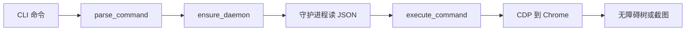

备选标题：

- 问题解决：让 AI 操作网页时，先拿元素编号再点击
- 用法场景：给编码代理一条能点按钮的浏览器命令
- 原理：agent-browser 怎样用无障碍树生成 @e 编号
- 克制判断：agent-browser 值得装，但先别从 chat 和云浏览器开始

---

分享一个实用的 AI 开源工具 agent-browser，你可以用它让 AI 代理按页面上的按钮、输入框和链接操作浏览器。

编码代理碰到网页，常见做法是把 HTML 整页塞进上下文，或者另写一段浏览器脚本。页面一长，上下文先被占满，选择器也容易在改版后失效。agent-browser 把这件事收成一组命令：打开页面，取出一份带编号的无障碍树，再用这些编号去点击和填写。

读完这篇，你会知道它实际做成了什么、一条命令怎样走到 Chrome，以及按文档怎样跑到第一张快照。我这次没有在本机跑。

## 这个项目是干什么的

agent-browser 是 Vercel Labs 仓库里的浏览器自动化命令行工具，定位写的是给 AI 代理用。无障碍树是浏览器按按钮、输入框、标题、链接整理出来的页面结构，比原始 HTML 短，也更接近人能操作的那些元素。

它适合已经在用 Cursor、Claude Code、Codex 这类编码代理，又希望代理自己打开文档站、后台或本地页面的人。

它不替你做爬虫，也不负责绕过验证码。`chat` 这种自然语言模式要另配 Vercel AI Gateway 的密钥。日常的 `open`、`snapshot`、`click` 不调用大模型。云浏览器和 iOS 模拟器都是可选接入。

一个具体场景：核对某个开源项目的文档站。代理打开页面，用快照找到安装说明的链接，点进去，再截一张图。你拿到的是命令结果和截图。

不适合的情况也很明确。你要的是带断言和 CI 报告的端到端测试，Playwright 那条路更对口。机器装不了 Chrome，或者目标站强依赖验证码，这个工具帮不上忙。

## 它实际做成了什么

核心是一轮本地浏览器会话。`open` 打开页面，`snapshot` 打出带引用的无障碍树，`click`、`fill`、`type` 对元素操作，`screenshot` 留下结果，`close` 结束会话。引用在命令里写成 `@e2`。文档把这种引用当成给 AI 的推荐路径。

配套能力可以后用。会话能命名，登录态能存到本机，也可以连到已经开了远程调试端口的 Chrome。`agent-browser mcp` 会起一个 MCP 服务。MCP 是让 AI 客户端调用外部工具的协议，这里默认只暴露 `core` 这组工具，避免把全部命令一次性塞进上下文。`npx skills add vercel-labs/agent-browser` 给编码代理准备技能说明，真正的步骤要求代理在运行时执行 `agent-browser skills get core`，免得说明和已安装的 CLI 版本对不上。

边界写在仓库里。域名白名单、动作确认、输出长度限制默认关闭。域名白名单和「复用 Chrome 配置、恢复登录态、连已有浏览器」不能一起用，文档写明这些组合会被拒绝。WebMCP 标了 experimental。iOS 需要 macOS、Xcode 和 Appium。Browserless、Browserbase、Browser Use 等云浏览器要各自的 API Key。

和这次阅读直接相关的版本事实：最新 GitHub Release 是 v0.38.1，发布时间 2026-09-16，`package.json` 也是 0.38.1。main 在这个 tag 之后还有提交。npm、Homebrew 或 Cargo 装到的是已发布包，不一定包含 main 上更新的修复。我没有再打开 npm 页面核对线上版本。

0.38.0 的更新记录里，截图可以用 `--if-changed` 跳过没变化的图，快照可以用 `--delta` 只返回变化，同一文档里还活着的元素会尽量保住原来的引用。这些我是从 CHANGELOG 读到的，没有在浏览器里验证。

## 它大概怎么工作

主链路是四步：你输入一条命令，CLI 把它编成 JSON，后台守护进程通过 CDP 操作 Chrome，再把结果打回终端。CDP 是 Chrome DevTools Protocol，浏览器对外的调试接口。守护进程在第一次命令时拉起，后面的命令复用同一个浏览器，所以 `open` 和 `snapshot` 可以分成两次调用。

我顺着源码看的是这条路径。

入口在 `cli/src/main.rs` 的 `main`。环境变量 `AGENT_BROWSER_DAEMON` 已设置时，进程直接跑 `native::daemon::run_daemon`。普通命令先走 `parse_command`。安装、升级、`doctor`、技能、插件、MCP 和 `chat` 在进守护进程之前就分流。其余命令收成带 `action` 字段的 JSON。

`cli/src/connection.rs` 的 `ensure_daemon` 发现本机没有可用守护进程时，会再次启动当前可执行文件，并带上 `AGENT_BROWSER_DAEMON=1`。Unix 用套接字文件，Windows 用本机 TCP。版本对不上就停掉旧进程再拉起，避免 CLI 和守护进程不是同一次发布。

`cli/src/native/daemon.rs` 的 `handle_connection` 按行读 JSON，然后调用 `execute_command`。这个函数在 `cli/src/native/actions.rs`，文件很大，我没有逐行读完。点击、导航、截图从调用关系上看都汇进这里，再经 `cli/src/native/cdp` 发给浏览器。

和 AI 最相关的一跳在快照。`cli/src/native/snapshot.rs` 的 `take_snapshot` 先 `Accessibility.enable`，再发 `Accessibility.getFullAXTree`。需要编号的节点分配成 `e1`、`e2`。同一文档里如果还能对上 `backendNodeId`，已有编号会留着。页面或 iframe 导航之后，文档要求重新快照，旧引用不要接着用。

默认大约 1 小时没有命令或仪表盘输入，无头浏览器会被关掉，守护进程退出。有界面的窗口，以及你已经连上的 Chrome，不在这个默认范围内。



`chat` 不在这条默认链路上。`cli/src/chat.rs` 要求 `AI_GATEWAY_API_KEY`，没设就退出。默认模型是 `anthropic/claude-sonnet-4.6`，默认网关在 `cli/src/native/stream/chat.rs` 里写成 `https://ai-gateway.vercel.sh`。不用 chat 时，模型是你的编码代理，agent-browser 只提供浏览器动作。

## 里面值得看的技术

技术栈以 Rust 为主。`cli/Cargo.toml` 依赖 Tokio 和 tokio-tungstenite，发布配置开了链接优化并去掉符号。npm 包是分发壳：`bin/agent-browser.js` 按系统找到对应二进制再拉起。守护进程不需要 Node.js，也不需要 Playwright。从源码构建时，README 要求 Node.js 24+、pnpm 11+ 和 Rust，`package.json` 的 `engines` 也写着 `node >= 24`。只做全局安装时，更低的 Node 会不会被 npm 拒绝，取决于本机 engines 策略。这一点我没有安装验证。

最值得看的设计是快照编号，模型不必自己写选择器。

编号在快照里生成，命令只消费编号。模型要决定的是点 `e2` 还是填 `e3`。文档还写了失败行为：点击点被别的元素挡住时，命令会提前失败，并带上挡住它的元素，例如同意条。处理方式是先关掉那一层，再重新快照。

```text
agent-browser snapshot -i
agent-browser click @e2
```

`-i` 只保留可交互元素，用来压上下文。`--json` 把快照和 refs 打成 JSON，方便代理解析。

安全功能默认关闭。域名白名单会拦掉名单外的导航和子资源，并在支持的 Chromium 会话里关掉 WebRTC，避免流量绕过拦截。它和复用本机 Chrome 配置不能一起用。本机试用可以保持原命令不变；真把代理放到不可信网页上时，再打开这些限制。凭证库也是这个方向，密码进本机加密存储，用名字登录，避免写进提示词。

## 按文档，怎么尽快跑起来

我这次没有在本机跑，下面是按仓库文档整理的最短路径。

环境上，日常使用要能下载并启动 Chrome。文档写的是执行 `agent-browser install`，从 Chrome for Testing 拉一份浏览器。本机已有的 Chrome、Brave，以及 Playwright、Puppeteer 自带的浏览器，会被探测。README 的平台表列出 macOS、Linux 的 x64 和 ARM64，以及 Windows x64。Windows ARM 上，`bin/agent-browser.js` 在找不到 ARM 二进制时会改用 x64 包。

安装用文档放在推荐位置的这条：

```bash
npm install -g agent-browser
agent-browser install
```

macOS 也可以 `brew install agent-browser`，然后再执行一次 `agent-browser install`。Linux 缺系统库时，文档写的是 `agent-browser install --with-deps`，装不齐会以非零状态退出。

最短操作不需要 API Key，在任意目录执行：

```bash
agent-browser open https://example.com
agent-browser snapshot -i
agent-browser screenshot /tmp/agent-browser-example.png
agent-browser close
```

怎样算跑起来了：文档没有给出 `open` 的固定终端输出。README 里那段同时出现 “Example Domain” 和 “Submit” 的快照是示意，我不当成 example.com 的真实结果。按命令含义，成功应当是这几条命令退出码为 0，`snapshot -i` 打出带 `[ref=eN]` 的列表，截图出现在你写的路径。若还没执行 `install`，预期是找不到浏览器。

文档里已经写明的卡点：点击被遮挡会失败，先处理遮挡再重新快照。`networkidle` 只适合页面确实会安静下来的情况。录屏依赖 ffmpeg。撰写时打开的 issue #2011，标题写着 ffmpeg 低于 5.1 时录制会失败，我没有复现。仪表盘命令是 `agent-browser dashboard start`，默认端口 4848。issue #2010 的标题是 macOS arm64 发布包缺少内嵌资源，启动仪表盘会报 “Dashboard not built”。要把仪表盘放进配图的话，建议你自己先跑这条命令。

诊断用 `agent-browser doctor`。`--fix` 会重装 Chrome、清掉旧状态，没确认之前不要加。

要试自然语言，再设密钥，不要写进仓库：

```bash
export AI_GATEWAY_API_KEY="你的密钥"
agent-browser chat "打开 example.com，总结页面标题"
```

没有密钥时，CLI 会报 `AI_GATEWAY_API_KEY not set` 并退出。这不影响前面的 `open` 和 `snapshot`。

## 你可以怎么用到自己身上

最值得先试的官方示例，就是 README 开头那条循环：打开页面，快照，按 `@eN` 点击或填写，截图，关闭。它演示的是代理该遵守的节奏：先看编号，再动作，页面变了就重新看。

往自己的工作里迁，这三件比较实。

第一，给编码代理加浏览器。先执行 `npx skills add vercel-labs/agent-browser`，再在项目说明里写死：`open`，`snapshot -i`，用 `@eN` 交互，变化后重新快照。登录态用 `--session` 加 `--restore`，状态文件在 `~/.agent-browser/sessions/`。密码用 `auth save` 从标准输入进本机凭证库。

第二，核对网页和留素材。我做开源项目内容时，要打开文档站、确认安装命令、截一张界面。代理可以用 `read` 拿适合阅读的文本，用 `screenshot --if-changed` 少存重复图。截图和命令输出仍然要你看过再发。

第三，机器不能装浏览器时，再看 `-p browserless` 或 `-p browseruse`，前提是对应的 API Key。先别从云浏览器开始。

想改代码，先看 `cli/src/main.rs`、`cli/src/connection.rs`、`cli/src/native/snapshot.rs` 和 `cli/src/native/daemon.rs`。新命令还要同时改 `cli/src/mcp.rs`。仓库的 AGENTS.md 要求命令行和 MCP 保持对齐。

代理需要在真实页面上点击、填写、截图，就用它。你要的是可重复的测试报告，就换 Playwright。页面不让自动化浏览器进来，就不要在这上面耗。

## 和相近项目比，它特别在哪

Playwright 仍然是写浏览器测试脚本时最常被提到的库。agent-browser 的 README 写明，守护进程不需要 Playwright，也不需要 Node.js。使用方式上，Playwright 是在代码里维护选择器和流程。agent-browser 是每条命令做一件事，浏览器留在守护进程里，代理通过快照编号决定下一步。这是定位差别，我没有做速度或稳定性对比。

Browser Use 是另一套面向 AI 代理的浏览器项目。agent-browser 的 README 把它写成可接入的云浏览器：设置 `BROWSER_USE_API_KEY`，再用 `-p browseruse`。本地命令仍然是 agent-browser，云端换的是浏览器进程。README 写了对方仓库的 star 数，我这次没有去那个仓库复核。

你要在测试代码里断言流程，用 Playwright。你要让编码代理用命令操作本机 Chrome，用 agent-browser。这台机器不能装浏览器，再看云浏览器，并准备 API 费用。

## 我的判断

我读完仓库后的判断是：如果你已经在用编码代理，又经常要看真实网页，它值得装一次，先走通 `install`、`open`、`snapshot -i`、`screenshot`。最有用的部分是快照编号和常驻浏览器。命令短，被挡住时知道被谁挡住，代理比较容易改下一步。

局限也具体。仓库创建于 2026-01-11，撰写时 Release 已经到 0.38，旗标还在变，写进长期脚本前要锁版本。打开的 issue 里，讨论较多的包括 Windows 上守护进程启动失败（#37、#132），以及无头 Chrome 残留进程占 CPU（#1371）。这些是撰写时仍打开的 issue，不代表你一定会遇到。安全限制默认关闭，把代理放到不可信网站上之前，要自己打开域名白名单和输出长度限制。许可证是 Apache-2.0，商业使用前看仓库里的 LICENSE。`chat` 和云浏览器都要外部密钥，会有费用。

下一步就一件事：装好 CLI，跑 `agent-browser install`，再对 `https://example.com` 做一次快照和截图。确认退出码和截图文件之后，再把技能装进编码代理。

仓库：https://github.com/vercel-labs/agent-browser

文档：https://agent-browser.dev

你现在让代理操作网页时，卡在选择器、登录态，还是浏览器根本起不来？如果你已经跑过 `snapshot -i`，欢迎把实际输出和文档示例差在哪里补在评论里。
